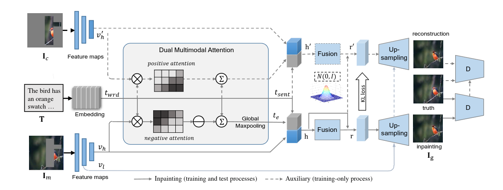

# Semantic Image Inpainting Evaluation
### Title:
Semantic Image Inpainting Evaluation: Classifying Generated Images from actual Image Inputs

### Objective/ Motivation:
To train a image inpainting model on cat's and dog's dataset and create a dataset containing original and generated images, later use these dataset to train a CNN model for classifying between generated and original images. The motivation behind doing this project is to help people or machines to identify if the image is authentic or forged/generated.

#### Link to github repo: 
click here for [github repo](https://github.com/HemanthGaddey/Semantic-Image-Inpainting-Evaluation)
click here for [preprocessed cat and dog datasets](https://drive.google.com/drive/folders/1M-4GTagjHYEWEhQdSvcwe-krvHWASuC3?usp=sharing)

### Prerequisites to run:
Download the folders and paste them in root directory | link: [google drive](https://drive.google.com/drive/folders/1nWcmNXBWeEIBP9lScZD4IWOWTYxPJqsp?usp=drive_link)

### Tasks:
#### Phase 1:
1.  Understand the reference papers and extensive codebase and Fix Dependency Issues
2.  Refactor Code and Rewrite TDANet
3.  Start Training TDANet
4.  Curate and preprocess the OxfordPets Dataset into a suitable format for training:
    a.  Convert Captions to appropriate format
    b.  Write Code for Generating random Masks for Images
    c.  Generate Masks for all the training images
    d.  Create an index file for image dataset with train/val/test splits
5.  Write the Pipeline for CNN Classifier using SwinTransformer and ResNext model and ensemble

the sample dataset made for training the classifier looks like [this](https://drive.google.com/drive/folders/1JRzKZlFbOVTTbPnbP18Yf_nKaGJd7mzX?usp=sharing)

#### Phase 2:
1.  create GUI (For using the CNN model, not the inpainting one)
2.  Generate inpainted images using script written in phase 1 but for cats. 
    -> If Model doesn't converge: Use bird dataset created in phase 1 along with a small dataset on IIT Bhilai surroundings to train the CNN.
3.  Train and Fine Tune the CNN model (Use transfer learning) on both bird dataset(done) and pets dataset(to be generated).
4.  Work on a GAN based classifier to more accurately classify using the above described datasets.
4.  Update the entire codebase to support latest library dependencies.

### How to train:
1.  Use pyenv to create a virtual environment with python3.6,
2.  Run the training code and for each 'module not found' error install the module using pip18(default) and the exact version we've written in requirements.txt [please do not run 'pip install -r requirements.txt']
3.  When finally cv2 'module not found' error occurs, update pip to latest version and continue step 2.
4.  We've uploaded the virtual environment to google drive: (Created on Arch Linux).
Run the jupyter notebook

## TDANet:
[paper](https://arxiv.org/pdf/2004.03212.pdf)

### Encoder part:
1. A text-guided dual attention model is proposed to complete image with the guidance of descriptive text. The combination of text and image provides richer semantics than only using the corrupted image.

2. TDANet takes masked image Im and text input T and outputs the inpainted image Ig. In the Encoder part it contains 3 parts, image encoder, text encoder and Dual multimodal Attention part.For the Image encoder we used a 7-layer ResNet from which the outputs of last layer(vl, high-level features) are passed on to the inpainting path while the weights of second last layer(vl, lower-level features) are subsequently passed to the Upsampling networks. The auxiliary part is used only during training  and all the models in auxiliary path share same weights as those in inpainting path except for the fusion network.

4. The masked image 'Ic'(the removed portion of the imput image) and image with mask 'Im'(the image with black pixels where the mask is applied) is fed to a 7-layer Residual Block Network for generating the feature maps of them, the top layer is taken as high-level representation vh'(for Ic)/vh(for Im) the output of the second last layer is used as low-level representation vl'(for Ic)/vl(for Im). For the text encoder we used a pre-trained GRU network(hidden size 256) which computes the word representation twrd and the sentence representation tsent.

5. In the auxiliary path the input is vh', while training the network learns which words in the description is similar to the masked image(this is called positive attention) because the key information about the missing region only exists in a subset of words and then softmax is applied to the attention scores generated and those attention score are done weighted sum with the text desciption for generating final text encodings te'.

6. In the inpainting path the input is vh, while training the network learns which words in the description is similar to the parts of the image other than the masked region(this is called negative attention), the attention score generated are multiplied with '-1' and are used for weighted sum with the text description, then global maxpool operation is done and finally generates text encodings te, this helps to know which words are less similar to the masked image

### Decoder Part:
1.  A multimodal hidden feature, h, is created by combining the phrase representation from the GRU network and the high level image representation from a 7-layer ResNet. This feature is then fed into a fusion network, F, which is a 5-layer Residual block network with spectral normalization in each layer. Projecting the features onto a latent space, the fusion network assumes that the latent space has a Gaussian distribution with mean μ and variance σ.

2.  Currently, on the auxiliary path, the fusion network F' has different trainable weights than the one on the inpainting path (F), in contrast to the Image Encoder, up-sampling network, or discriminator network. This is carried out because h and h' have distinct properties.

3.  In the inpainting step, we now sample latent variables from the distribution (the previously derived gaussian distribution) and combine with h to create r, a multimodal representation. This guarantees variation in the output of the generator.
$$r = h+Gaussian(μ,σ)$$

4.  We also use the previously obtained distribution to produce r' in the Auxiliary path. However, since this distribution differs and we need the final multimodal representation to be homogeneous in both paths to obtain identical images, we include h from the inpainting path here.
$$r' = h+Gaussian(μ',σ')$$

5.  In both approaches, the multimodal representations r and r' are ultimately delivered to the Generator networks (up-sampling networks) with identical weights.

6.  The generator networks are 5 layer Residual networks. Five layer residual networks make up the generator networks. We feed the intermediate level image representation from the original image (vl, from the last second layer of the Image Encoder network, since we don't need to predict the rest of the area) and the multimodal representation r (to predict the masked region) with a short+long term attention to the generator in the inpainting path. The goal of this short- and long-term focus is to guarantee accurate reconstruction of the image's unmasked regions. By using a self-attention network, the network basically determines the weightmap between encoder and decoder features and then weights and sums these feature maps. The generator concatenates the weighted feature maps and reconstructs the unmasked areas.

### Training:
The inpainting model is still training and currently 228 epochs are done. We aim to train till 2000 epochs for generating good inpainted images for pets. The results and the loss values for each epoch are present in 'result' directory in the github repo.

### CNN:
We used Swin Transformer and ResNext101 for training the CNN classifier, the entire complete code for which is pushed to github repo. We plan to ensemble these two models via stacking.
Then we train this model on the bird dataset( which includes authentic images and inpainted examples using all ~10k images in CUB datasets which we created and uploaded to google drive, the link of which is given in github).

### Individual contribution:
### Hemanth:
Worked on writing code for the models related to the dual attention mechanism (the encoder part). Did major TDANet Code refactoring and wrote the code for training(training.py) and the jupyter notebook. Worked on fixing dependency issues. Worked on GUI also which is still in process as all of us followed a parallel approach for this project.

### Chaitanya:
Worked on writing the code for the fusion network and discriminator network (the decoder part). Testing the TDAnet model and generate the required dataset (from CUB-200-201) to train the classifier and get pre trained weights and use it for transfer learning (without freezing layers) on Oxford pets dataset. 

### Deva Surya Prasad:
Worked on creating the CNN pipeline for Resnet and Swin Transformer and preprocess the Oxford pets dataset from Hugging face into the format necessary for the inpainting model.please view the git hub repo for the code and other explanations. 
